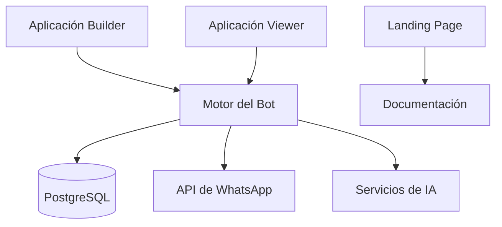

# Plataforma Quick.Bot

## 📋 Tabla de Contenidos

- [Descripción General del Proyecto](#descripción-general-del-proyecto)
- [Prerrequisitos](#prerrequisitos)
- [Instalación](#instalación)
- [Flujo de Desarrollo](#flujo-de-desarrollo)
- [Gestión de Base de Datos](#gestión-de-base-de-datos)
- [Pruebas](#pruebas)
- [Despliegue](#despliegue)
- [Configuración de Almacenamiento S3](#configuración-de-almacenamiento-s3)
- [Documentación de API](#documentación-de-api)
- [Monitoreo y Soporte](#monitoreo-y-soporte)

## 🏗️ Descripción General del Proyecto

Quick.Bot es una potente plataforma para construir y gestionar bots conversacionales, con especial
énfasis en la integración con WhatsApp. El proyecto sigue una arquitectura de monorepo utilizando
Turborepo.

### Arquitectura

```
quick.bot/
├── apps/
│   ├── builder/     # Aplicación constructora de bots
│   ├── viewer/      # Visor/reproductor de bots
│   ├── landing-page/# Sitio web de marketing
│   └── docs/        # Sitio de documentación
├── packages/
│   ├── bot-engine/  # Motor central del bot
│   ├── prisma/      # Esquema y migraciones de base de datos
│   ├── ui/          # Componentes UI compartidos
│   ├── ai/          # Integraciones de IA
│   └── ...          # Otros paquetes compartidos
```

### Stack Tecnológico

- **Frontend**: Next.js 14, React, TypeScript
- **Backend**: Node.js 22.x, Bun 1.2.x
- **Base de Datos**: PostgreSQL
- **ORM**: Prisma
- **Almacenamiento**: S3 Compatible Storage
- **Testing**: Playwright, Jest
- **CI/CD**: GitHub Actions, Vercel
- **Monitoreo**: Sentry, PostHog
- **Contenedores**: Docker

### Diagrama de Componentes



## 🔧 Prerrequisitos

- Node.js v22.x
- Bun 1.2.x
- Docker y Docker Compose
- PostgreSQL 15+
- Git

## 🚀 Instalación

1. Clonar el repositorio:

   ```bash
   git clone https://github.com/urbiport/quick.bot.git
   cd quick.bot
   ```

2. Instalar dependencias:

   ```bash
   bun install
   ```

3. Configurar variables de entorno:

   ```bash
   cp .env.dev.example .env
   # Editar .env con tu configuración
   ```

4. Iniciar el entorno de desarrollo:

   ```bash
   bun run docker:up
   bun run db:migrate:deploy
   bun run db:seed
   bun run dev
   ```

5. Limpieza (si es necesario):
   ```bash
   bun run clean
   ```

## 💻 Flujo de Desarrollo

### Estrategia de Ramas

- `develop`: Rama principal de desarrollo
- `master`: Rama de producción
- Ramas de características: `feature/descripción`
- Correcciones de errores: `fix/descripción`
- Correcciones urgentes: `hotfix/descripción`

### Convención de Commits

Seguimos la especificación de [Conventional Commits](https://www.conventionalcommits.org/):

```
<tipo>(<alcance>): <descripción>

[cuerpo opcional]

[pie de página opcional]
```

### Proceso de Pull Request

1. Crear una rama de característica desde `develop`
2. Realizar cambios
3. Escribir/actualizar pruebas
4. Actualizar documentación
5. Crear PR a `develop`
6. Esperar que pasen las verificaciones de CI
7. Obtener al menos una revisión
8. Fusionar después de la aprobación

### Pipeline de CI/CD

1. **GitHub Actions**:

   - Verificación de lint y tipos
   - Pruebas unitarias
   - Pruebas E2E
   - Verificación de build

2. **SonarCloud**:

   - Análisis de calidad de código
   - Escaneo de seguridad
   - Cobertura de código

3. **Vercel**:
   - Despliegues de vista previa para PRs
   - Despliegues de producción desde `master`

## 🗄️ Gestión de Base de Datos

### Comandos de Prisma

```bash
# Generar Cliente Prisma
bun run db:generate

# Crear migración
bun run db:migrate:dev

# Aplicar migraciones
bun run db:migrate:deploy

# Reiniciar base de datos
bun run db:reset

# Poblar base de datos
bun run db:seed

# Reparar migraciones fallidas
bun run db:migrate:fix
```

### Esquema de Base de Datos

El esquema completo de la base de datos se encuentra en `packages/prisma/postgresql/schema.prisma`.

### Datos Iniciales

Los datos iniciales se cargan usando `packages/prisma/postgresql/seed.ts`. Ejecutar con:

```bash
bun run db:seed
```

## 🧪 Pruebas

### Tipos de Pruebas

1. **Pruebas Unitarias**:

   ```bash
   bun test
   ```

2. **Pruebas de Integración**:

   ```bash
   bun run test:integration
   ```

3. **Pruebas E2E**:
   ```bash
   bun run test:e2e
   ```

### Estructura de Pruebas con Playwright

```typescript
test.describe('Característica > Componente', () => {
  test('Debería hacer algo específico', async () => {
    await test.step('Descripción del paso 1', async () => {})
    await test.step('Descripción del paso 2', async () => {})
    await test.step('Descripción del paso 3', async () => {})
  })
})
```

## 🚀 Despliegue

### Entornos

- **Desarrollo**: rama `develop`
- **Producción**: rama `master`

### Proceso de Despliegue

1. Push a la rama correspondiente
2. Pipeline de CI/CD se ejecuta automáticamente
3. Vercel despliega al entorno correspondiente
4. Se ejecutan verificaciones de salud
5. Comienza el monitoreo

## 💾 Configuración de Almacenamiento S3

QuickBot requiere un bucket S3 para almacenar archivos subidos. Puedes usar cualquier proveedor de
almacenamiento compatible con S3:

- [AWS S3](https://aws.amazon.com/s3/)
- [DigitalOcean Spaces](https://www.digitalocean.com/products/spaces/)
- [Wasabi](https://wasabi.com/)
- [MinIO](https://min.io/)

### Configuración Requerida del Bucket

Tu bucket S3 debe tener la siguiente configuración:

#### Política CORS

```json
{
  "CORSRules": [
    {
      "AllowedHeaders": ["*"],
      "AllowedMethods": ["PUT", "POST"],
      "AllowedOrigins": ["*"],
      "ExposeHeaders": ["ETag"]
    }
  ]
}
```

#### Política de Acceso

Reemplaza `<bucket-name>` con el nombre de tu bucket S3:

```json
{
  "Version": "2012-10-17",
  "Statement": [
    {
      "Sid": "PublicRead",
      "Effect": "Allow",
      "Principal": "*",
      "Action": "s3:GetObject",
      "Resource": "arn:aws:s3:::<bucket-name>/public/*"
    }
  ]
}
```

### Configuración desde Línea de Comandos

Si tu proveedor S3 no tiene interfaz web para configurar políticas, puedes usar AWS CLI:

#### Configurar Política CORS

1. Crear archivo `cors-policy.json` con la política CORS mostrada arriba
2. Ejecutar:
   ```bash
   aws s3api put-bucket-cors --bucket <bucket-name> --cors-configuration file://cors-policy.json
   ```

#### Configurar Política de Acceso

1. Crear archivo `bucket-policy.json` con la política de acceso mostrada arriba
2. Ejecutar:
   ```bash
   aws s3api put-bucket-policy --bucket <bucket-name> --policy file://bucket-policy.json
   ```

## 📚 Documentación de API

### Documentación OpenAPI

1. Iniciar el servidor de documentación:

   ```bash
   cd apps/docs
   bun run dev
   ```

2. Acceder a la documentación en `http://localhost:3000/api-docs`

### Referencia de API

La referencia completa de la API está disponible en [docs.quick.bot/api](https://docs.quick.bot/api)

## 📊 Monitoreo y Soporte

### Sentry

- Seguimiento de errores
- Monitoreo de rendimiento
- Retroalimentación de usuarios
- [Panel de Sentry](https://sentry.io/urbiport)

### PostHog

- Análisis de usuarios
- Flags de características
- Pruebas A/B
- [Panel de PostHog](https://app.posthog.com/urbiport)

## 📝 Licencia

Este proyecto está licenciado bajo la Licencia MIT - ver el archivo [LICENSE](LICENSE) para más
detalles.

## 🤝 Contribución

Por favor, lee [CONTRIBUTING.md](CONTRIBUTING.md) para detalles sobre nuestro código de conducta y
el proceso para enviar pull requests.
