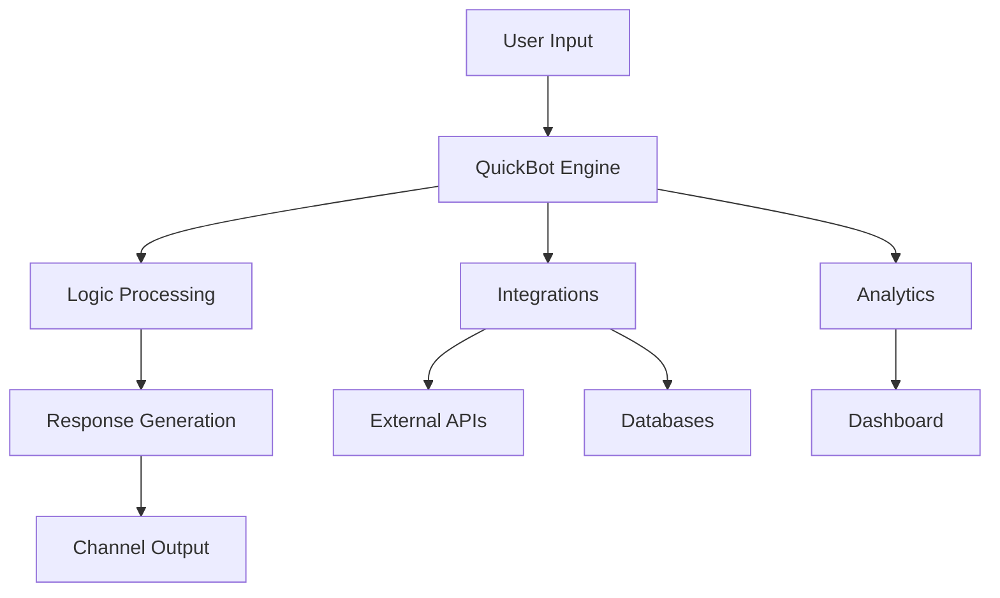

In the Builder, you can visually craft your conversations without touching a single line of code.
From automated support assistants to lead-capturing funnels and engaging surveys, the Builder gives
you a complete toolkit to design, customize, and launch your bots.

## What You Can Build

<CardGroup cols={2}>
  <Card title="Customer Support" icon="headset" href="/builder/editor/blocks/general">
    Handle common questions and route complex issues to human agents
  </Card>
  <Card title="Lead Generation" icon="user-plus" href="/builder/editor/blocks/user/email">
    Capture leads with interactive forms and qualification flows
  </Card>
  <Card
    title="E-commerce Assistant"
    icon="shopping-cart"
    href="/builder/editor/blocks/integrations/woocommerce"
  >
    Help customers find products and complete purchases
  </Card>
  <Card title="Surveys & Feedback" icon="chart-bar" href="/builder/editor/blocks/user/rating">
    Collect user feedback with engaging conversational surveys
  </Card>
</CardGroup>

## Key Features

### Visual Flow Builder

Design your bot's conversation flow with our intuitive drag-and-drop editor. No coding required.

### Rich Content Blocks

- **Agent Blocks**: Text, images, videos, audio, and embeds
- **User Input Blocks**: Forms, buttons, file uploads, and more
- **Logic Blocks**: Conditions, variables, redirects, and scripts
- **Integration Blocks**: Connect with external services and APIs

### Multi-Channel Deployment

Deploy your bots across multiple channels:

- Website widget
- WhatsApp Business
- API endpoints
- Custom integrations

### Analytics & Insights

Track performance with built-in analytics:

- Conversation metrics
- User engagement
- Conversion tracking
- Response analysis

## Getting Started Steps

<Steps>
  <Step title="Create Your First Bot">
    Start with our [First Bot guide](/builder/getting-started/first-bot) to build a simple
    conversational experience
  </Step>
  <Step title="Customize & Test">
    Use the [Bot Editor](/builder/editor/flow) to add blocks and customize your bot's behavior
  </Step>
  <Step title="Deploy">
    Follow the [Deployment guide](/builder/getting-started/deployment) to publish your bot
  </Step>
</Steps>

## Architecture Overview

## Best Practices

<Warning>Keep these principles in mind while building your bots:</Warning>

- **Start Simple**: Begin with basic flows and add complexity gradually
- **Test Early**: Use the preview feature to test conversations frequently
- **Plan User Paths**: Map out different conversation scenarios before building
- **Handle Errors**: Always provide fallback options for unexpected inputs
- **Mobile First**: Design for mobile users as they make up the majority of traffic

## Need Help?

- Check our [FAQ](/support/faq) for common questions
- Browse the [Bot Editor documentation](/builder/editor/flow)
- Contact [Support](/support/contact) for assistance

Ready to build your first bot? Let's [get started](/builder/getting-started/first-bot)!
